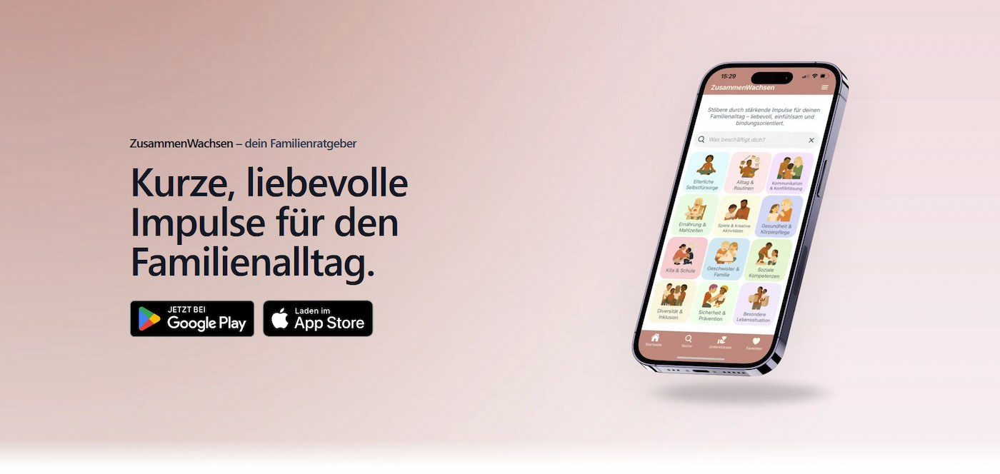

# ZusammenWachsen – Landing Page

<div align="center">
  
</div>

<br/>

Kleine, moderne Landingpage für die ZusammenWachsen App.  
Das Projekt dient als Web-Showcase, um meine Arbeit mit **Next.js (App Router)** und **TypeScript** zu demonstrieren.

Die eigentliche Produkt- und App-Story befindet sich im [separaten App-Repository](https://github.com/PhilippW22/zusammenwachsen_app) – diese Landingpage fokussiert sich bewusst auf **Frontend-Umsetzung**, **UX-Details** und **saubere Architektur im Web**.

---

## 🎯 Ziel des Projekts

- Umsetzung einer realen Landingpage mit **Next.js & TypeScript**
- Übertragung eines bestehenden Produkts in einen modernen Web-Stack
- Fokus auf **Lesbarkeit**, **Performance** und ruhige UX
- Saubere, nachvollziehbare Code-Struktur statt Feature-Overkill

---

## 🛠 Tech Stack

**Framework:** Next.js (App Router)  
**Language:** TypeScript  
**Styling:** Tailwind CSS  
**Animation:** Framer Motion  
**Testing:** Playwright (E2E)  
**SEO:** Metadata, OpenGraph, Structured Data  
**Deployment:** Vercel

---

## 🧠 Bewusste Entscheidungen (Auswahl)

**Bottom Navigation statt klassischem Header:** Immer sichtbarer Download-CTA, mobile-first gedacht – bewusst auch auf Desktop.

**Animated Counter statt klassischer Feature-Animationen:** Weniger visuelle Ablenkung, Fokus auf ruhige Informationsvermittlung.

**Feste Höhen bei Testimonials:** Verhindert Layout-Shifts bei unterschiedlich langen Texten.

---

## 🧪 Qualität & Testing

- End-to-End-Tests mit **Playwright** (Desktop & Mobile)
- Fokus auf reale User-Flows (Navigation, FAQ, Testimonials)
- Getestet auf Desktop und Mobile Viewports

---

## 📦 Lokal starten

```bash
npm install
npm run dev
```

---

## 🌐 Live-Version

[https://www.zusammenwachsenapp.de](https://www.zusammenwachsenapp.de)

---

## 👤 Autor

**Philipp Winkler**  
Frontend & Mobile Development

[](https://www.linkedin.com/in/philipp-winkler-b959b13a0/)

Dieses Projekt ist bewusst schlank gehalten und zeigt meine Arbeitsweise mit modernen Web-Technologien – ohne Anspruch auf Vollständigkeit oder Perfektion.

---

<div align="center">

**Portfolio-Projekt** | Next.js 14 · TypeScript · Playwright | 2025

</div>
